# CS203 Lab 6

# Team
## Team Number: 33

## Team Members

### Member 1

- Name: Vivek Raj
- Roll No: 23110362
- Github: VivekRaj2708

### Member 2

- Name: Sharvari Mirge
- Roll No: 23110298
- Github: msharvari31

## Repository Details

- Link to Repository: <a href="https://github.com/VivekRaj2708/Lab6_CS203">https://github.com/VivekRaj2708/Lab6_CS203</a>

<div style="page-break-before: always;"></div>

# Procedure


## Dataset

1. We get the IRIS Dataset from `sklearn`

```python
from sklearn.datasets import load_iris
```

2. Dataset Cleaning and labelling. We clean the dataset, append the labels and then normalise the data.

```python
data = load_iris()
X = data['data']
Y = data['target']
labels = []

for x in range(len(Y)):
    if Y[x] == 0:
        labels.append('setosa')
    elif Y[x] == 1:
        labels.append('versicolor')
    else:
        labels.append('virginica')  

X_normed = X / X.max(axis=0)
```

3. Now we have to split the dataset into `Train` (70%), `Validation` (20%) and `Test` (10%). We use `sklearn` for that also.

```python
X_train, X_testing, y_train, y_testing = train_test_split(X_normed, Y, test_size=0.3, random_state=20)
X_validation, X_test, y_validation, y_test = train_test_split(X_testing, y_testing, test_size=0.33, random_state=20)
print(X_train.shape, X_validation.shape, X_test.shape, y_train.shape, y_validation.shape, y_test.shape)
```

4. We make torch dataset out of our generated Train/Validation and Test Splits

```python
X_train_model = tensor(X_train, dtype=torch.float32)
y_train_model = tensor(y_train)

train_dataset = TensorDataset(X_train_model, y_train_model)
train_loader = DataLoader(train_dataset, batch_size=32, shuffle=True)

val_dataset = TensorDataset(tensor(X_validation, dtype=torch.float32), tensor(y_validation))
val_loader = DataLoader(val_dataset, batch_size=32, shuffle=True)

test_dataset = TensorDataset(tensor(X_test, dtype=torch.float32), tensor(y_test))
test_loader = DataLoader(test_dataset, batch_size=32, shuffle=True)
```

<div style="page-break-before: always;"></div>


## Torch Initialisation

1. Device Selection

```python
import torch
device = torch.device('cuda' if torch.cuda.is_available() else 'cpu')
```

2. Architecture Declaration

    We use the following architecture for training on the IRIS Dataset. We will use pytorch to make the model as well

   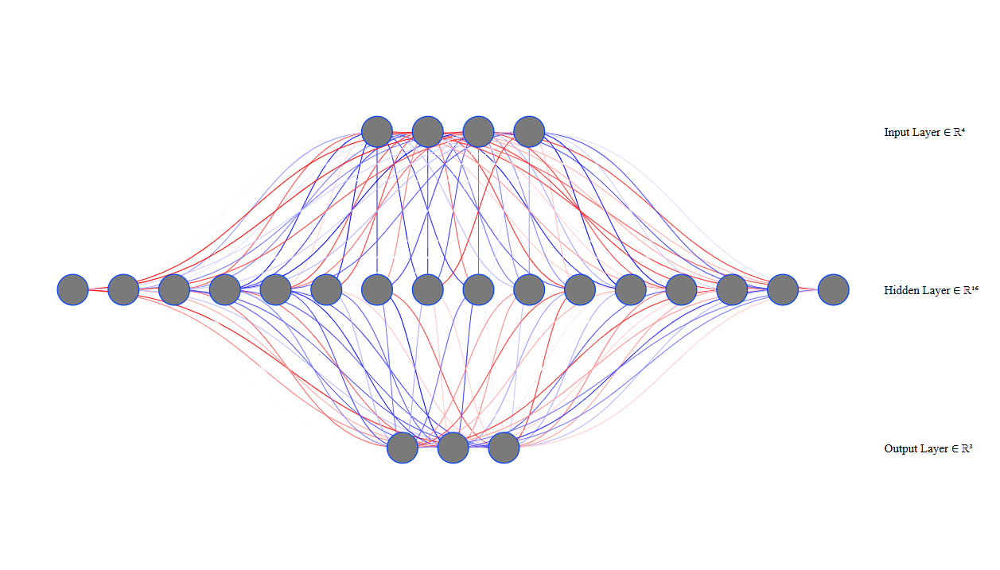

```python
class MLP(nn.Module):
    def __init__(self) -> None:
        super(MLP, self).__init__()
        self.layer1 = nn.Linear(4, 16)
        self.activation = nn.ReLU()
        self.layer2 = nn.Linear(16, 3)
        self.softmax = nn.Softmax()

    def forward(self, x):
      x = self.layer1(x)
      x = self.activation(x)
      x = self.layer2(x)
      x = self.softmax(x)
      return x

model = MLP()
model.to(device)
optimiser = AdamW(model.parameters(), lr=0.001)
criteria = CrossEntropyLoss()
```

<div style="page-break-before: always;"></div>

## Model Training

We train the model on the following parameters:

1. 50 Epochs
2. 10<sup>-3</sup> Learning Rate
3. AdamW Optimiser
4. CrossEntropyLoss Loss Criteria

```python
epochs = 50
model.train()

training_loss = []
valid_loss = []

for epoch in range(epochs):
    running_loss = 0.0
    val_loss = 0.0
    model.train()
    for X_batch, Y_batch in train_loader:
        X_batch, Y_batch = X_batch.to(device), Y_batch.to(device)
        optimiser.zero_grad()
        outputs = model(X_batch)
        loss = criteria(outputs, Y_batch)
        loss.backward()
        optimiser.step()
        running_loss += loss.item()
    avg_loss = running_loss / len(train_loader)
    training_loss.append(avg_loss)

    model.eval()
    with torch.no_grad():
      for inputs, labels in val_loader:
          inputs, labels = inputs.to(device), labels.to(device)
          outputs = model(inputs)
          loss = criteria(outputs, labels)
          val_loss += loss.item()
      avg_val_loss = val_loss / len(val_loader)
      valid_loss.append(avg_val_loss)

    if (epoch+1) % 10 == 0:
      print(f'Epoch {epoch+1}/{epochs}, Test Loss: {avg_loss:.4f}, , Val Loss: {avg_val_loss:.4f}')
```

<div style="page-break-before: always;"></div>

## Model Evaluation

Now we test the model on our test dataset (10%)

```python
model.eval()

pred = []
label = []
with torch.no_grad():
    for inputs, labels in test_loader:
        label.append(labels)
        inputs, labels = inputs.to(device), labels.to(device)
        outputs = model(inputs)

        # Update the test accuracy
        _, preds = torch.max(outputs, 1)
        pred.append(preds.cpu().numpy()
```

<div style="page-break-before: always;"></div>

## Model Metrics

We will calculate the F1 score, Prescrision, Recall and Accuracy using the `skealrn` module

```python
pred = np.array(pred).flatten()
label = np.array(label).flatten()
accuracy = accuracy_score(pred, label)
recall = recall_score(pred, label, average="weighted")
precision = precision_score(pred, label, average="weighted")
f1 = f1_score(pred, label, average="weighted")

print("Acc: ", accuracy, "\nRecall:",  recall, "\nPrescision:", precision, "\nF1:", f1)

df_cm = pd.DataFrame(confusion_matrix(pred, label),
                  index = data['target_names'],
                  columns = data['target_names'])

sn.heatmap(df_cm, annot=True, cmap="Reds")
plt.xlabel("True")
plt.ylabel("Predicted")
```

### Metric Details:

| Metric     | Value  |
|------------|--------|
| Accuracy   | 0.667  |
| Recall     | 0.667  |
| Precision  | 1.000  |
| F1 Score   | 0.769  |


### Confusion Matrics
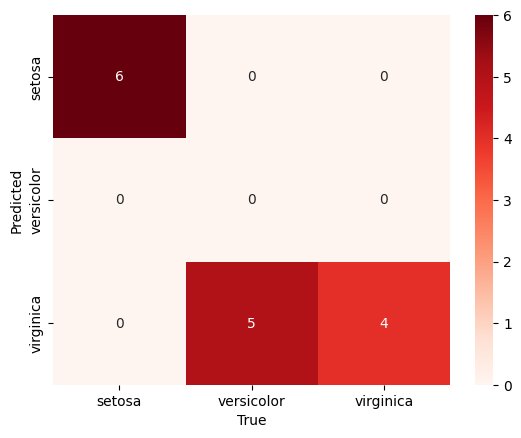

<div style="page-break-before: always;"></div>

## Training Loss vs Vaidation Loss

According to the question we have to plot the training and the validation loss using `MatPlotLib`

```python
plt.plot(training_loss, label='Training Loss')
plt.plot(valid_loss, label='Validation Loss')
plt.xlabel('Epoch')
plt.ylabel('Loss')
plt.legend()
plt.show()
```

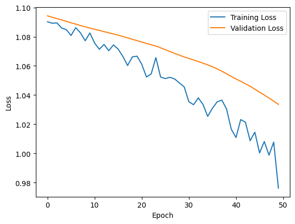


The plot above represents the **Training Loss** and **Validation Loss** over **50 epochs**.

### Observations:
- The **Training Loss** (blue line) steadily decreases with fluctuations, indicating that the model is learning.
- The **Validation Loss** (orange line) also decreases but remains consistently higher than the training loss.
- The gap between training and validation loss suggests some level of **overfitting**, where the model generalizes less effectively on unseen data.
- The fluctuations in training loss could be due to **learning rate variations** or **batch randomness**.

<div style="page-break-before: always;"></div>

## WandB Initialisation

### Installation

```bash
pip install wandb
```

### Login

```bash
wandb login
```

We give the API Key generated by https://wandb.ai/authorize

### Initialisation Parameters

We register the following details to WandB before we proceed to the actual model traing

#### Project Details
- **Project Name:** STT-For-AI-Lab6  
- **Run Name:** Run 24022025-4  

#### Model Architecture
- **Type:** Multi-Layer Perceptron (MLP)  
- **Layers:**
  - **Input Layer:** 4 neurons  
  - **Hidden Layer:** 16 neurons  
  - **Output Layer:** 3 neurons  

#### Activation Functions
- **Hidden Layer Activation:** ReLU  
- **Output Layer Activation:** Softmax  

#### Hyperparameters
- **Batch Size:** 32  
- **Epochs:** 50  
- **Learning Rate:** 0.001  

#### Dataset
- **Dataset Used:** IRIS  

<div style="page-break-before: always;"></div>

#### Code

This is the initialisation function:

```python
wandb.init(
    project="STT-For-AI-Lab6",
    name="Run 24022025-4",
    config={
      "architecture": "MLP",
      "Layers": {
          "Input": 4,
          "Hidden": 16,
          "Output": 3
      },
      "Activation": ["ReLU", "Softmax"],
      "Hyperparameter": {
              "batch_size": 32,
                "epochs": 50,
              "learning_rate": 0.001
      },
      "dataset": "IRIS",
    }
)
```
<div style="page-break-before: always;"></div>

## Actual Training in WandB

We traing the model again and log the losses and metrics using the `log` method in the `wandb` module

### Initialisation Parameters

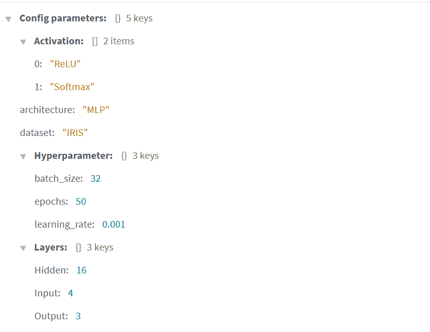

### Charts

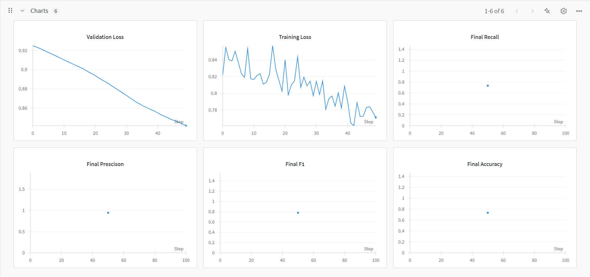

### Loss Curve and Confusion Matrics

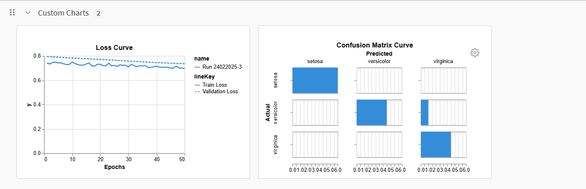

<div style="page-break-before: always;"></div>

## Autogluen Initialisation

### Installation

```bash
pip install autogluon
```

### Import

```python
import autogluon as ag
from autogluon.tabular import TabularDataset, TabularPredictor
from autogluon.core.models import AbstractModel
import autogluon.common as agco
```

We import the following from autoguon:

| Import Module               | Module Name                | Use Case Description                                      |
|-----------------------------|---------------------------|-----------------------------------------------------------|
| `autogluon`                 | `ag`                      | Main module for AutoGluon, providing AutoML capabilities. |
| `autogluon.tabular`         | `TabularDataset`          | Handles tabular data loading and preprocessing.          |
| `autogluon.tabular`         | `TabularPredictor`        | Generates models for tabular data with AutoML features.  |
| `autogluon.core.models`     | `AbstractModel`           | Base class for defining custom models in AutoGluon.      |
| `autogluon.common`          | `agco`                    | Contains utilities and common components for AutoGluon.  |

<div style="page-break-before: always;"></div>

### Hyperparameters

```python
ag.tabular.models.tabular_nn.hyperparameters.parameters.get_hyper_params(framework='pytorch')
```

We see that the following parameters can be tweaked in the `NN_TORCH` model:

```json
{
    "activation": "relu",
    "embedding_size_factor": 1.0,
    "embed_exponent": 0.56,
    "max_embedding_dim": 100,
    "y_range": "None",
    "y_range_extend": 0.05,
    "dropout_prob": 0.1,
    "optimizer": "adam",
    "learning_rate": 0.0003,
    "weight_decay": 1e-06,
    "proc.embed_min_categories": 4,
    "proc.impute_strategy": "median",
    "proc.max_category_levels": 100,
    "proc.skew_threshold": 0.99,
    "use_ngram_features": False,
    "num_layers": 4,
    "hidden_size": 128,
    "max_batch_size": 512,
    "use_batchnorm": false,
    "loss_function": "auto"
}
```

<div style="page-break-before: always;"></div>

### Abstract Model Generation

We make a custom model for hyperparameter tuning called `PyTorchWrapper` which inherits from `AbstractClass`

```python
from autogluon.core.models import AbstractModel

class PyTorchWrapper(AbstractModel):
    def __init__(self, **kwargs):
        super().__init__(**kwargs)
        self.model = None
        self.num_epochs = kwargs.get('num_epochs', 5)
        self.learning_rate = kwargs.get('learning_rate', 1e-3)
        self.batch_size = kwargs.get('batch_size', 2)

    def _fit(self, X, y, **kwargs):
        # Convert data to PyTorch tensors
        X_tensor = torch.tensor(X.values, dtype=torch.float32)
        y_tensor = torch.tensor(y.values, dtype=torch.float32)

        # Initialize the model
        self.model = MLP()

        # Define loss and optimizer
        optimiser = AdamW(model.parameters(), lr=self.learning_rate)
        criteria = CrossEntropyLoss()

        # Training loop
        for epoch in range(self.num_epochs):  # Adjust epochs as needed
            optimiser.zero_grad()
            outputs = self.model(X_tensor)
            loss = criteria(outputs, y_tensor)
            loss.backward()
            optimiser.step()

    def _predict(self, X, **kwargs):
        X_tensor = torch.tensor(X.values, dtype=torch.float32)
        with torch.no_grad():
            predictions = self.model(X_tensor)
        return predictions.numpy()
```

<div style="page-break-before: always;"></div>

### Grid Search

We will do a grid search using AutoGloun (backend: `Ray Tuner` and get the model parameters)

Search Space was defined aas the following

```python
search_space = {
    "lr": tune.grid_search([1e-3, 1e-5]),
    "num_epochs": tune.grid_search([1,3,5]),
    "batch_size": tune.grid_search([2, 4])
}
```


#### Experiment Configuration: `train_MLP_2025-02-26_13-21-53`

| Parameter              | Value                   |
|------------------------|------------------------|
| **Search Algorithm**   | BasicVariantGenerator  |
| **Scheduler**          | FIFOScheduler          |
| **Number of Trials**   | 12                     |                           |

#### Output

| Trial Name            | Status     | Learning Rate | Epochs | Batch Size | Iter | Total Time (s) | Accuracy  | F1 Score  |
|-----------------------|-----------|--------------|--------|------------|------|----------------|-----------|-----------|
| train_MLP_b82a5_00000 | TERMINATED | 0.001        | 1      | 2          | 1    | 5.10377        | 0.266667  | 0.421053  |
| train_MLP_b82a5_00001 | TERMINATED | 0.001        | 1      | 4          | 1    | 4.71742        | 0.266667  | 0.421053  |
| train_MLP_b82a5_00002 | TERMINATED | 1e-05        | 1      | 2          | 1    | 4.99102        | 0.266667  | 0.421053  |
| train_MLP_b82a5_00003 | TERMINATED | 1e-05        | 1      | 4          | 1    | 4.80002        | 0.400000  | 0.571429  |
| train_MLP_b82a5_00004 | TERMINATED | 0.001        | 3      | 2          | 1    | 5.39796        | 0.666667  | 0.786325  |
| train_MLP_b82a5_00005 | TERMINATED | 0.001        | 3      | 4          | 1    | 5.11316        | 0.333333  | 0.500000  |
| train_MLP_b82a5_00006 | TERMINATED | 1e-05        | 3      | 2          | 1    | 5.30945        | 0.400000  | 0.571429  |
| train_MLP_b82a5_00007 | TERMINATED | 1e-05        | 3      | 4          | 1    | 5.08326        | 0.333333  | 0.500000  |
| train_MLP_b82a5_00008 | TERMINATED | 0.001        | 5      | 2          | 1    | 5.61105        | 0.666667  | 0.769231  |
| train_MLP_b82a5_00009 | TERMINATED | 0.001        | 5      | 4          | 1    | 4.98850        | 0.666667  | 0.769231  |
| train_MLP_b82a5_00010 | TERMINATED | 1e-05        | 5      | 2          | 1    | 5.62792        | 0.266667  | 0.421053  |
| train_MLP_b82a5_00011 | TERMINATED | 1e-05        | 5      | 4          | 1    | 5.19684        | 0.333333  | 0.500000  |

It took us a total of 61.94 secondsfor the computation in Grid Search

<div style="page-break-before: always;"></div>

### Best Configuration

```json
{
  "lr": 0.001,
  "num_epochs": 3,
  "batch_size": 2
}
```
<div style="page-break-before: always;"></div>

### Confusion Matrics of all models

#### Model 1

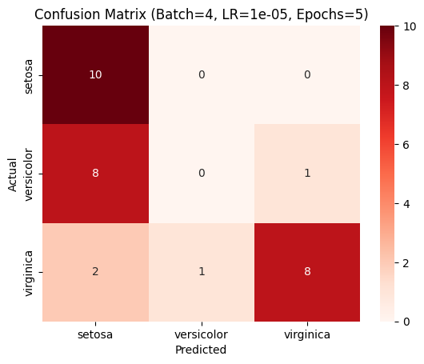

#### Model 2
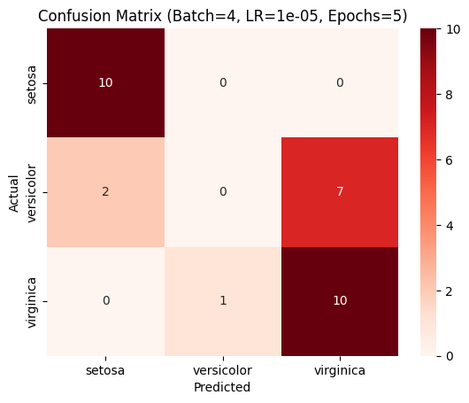

<div style="page-break-before: always;"></div>

#### Model 3


#### Model 4


<div style="page-break-before: always;"></div>

#### Model 5


#### Model 6


<div style="page-break-before: always;"></div>

#### Model 7


#### Model 8
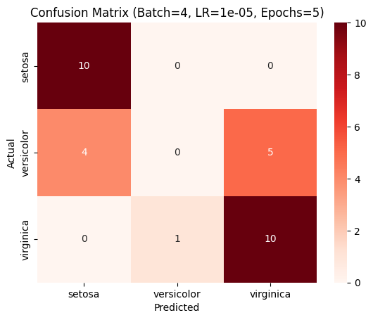

<div style="page-break-before: always;"></div>

#### Model 9


#### Model 10


<div style="page-break-before: always;"></div>

#### Model 11
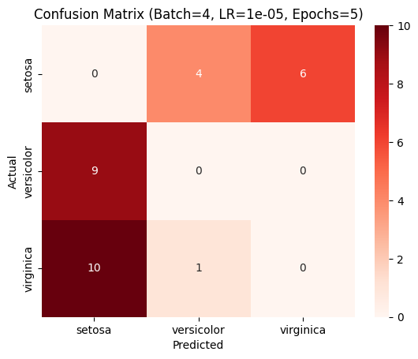

#### Model 12


<div style="page-break-before: always;"></div>

### Training Loss vs Validation Loss
Relationship between Training Loss and Validation Loss:

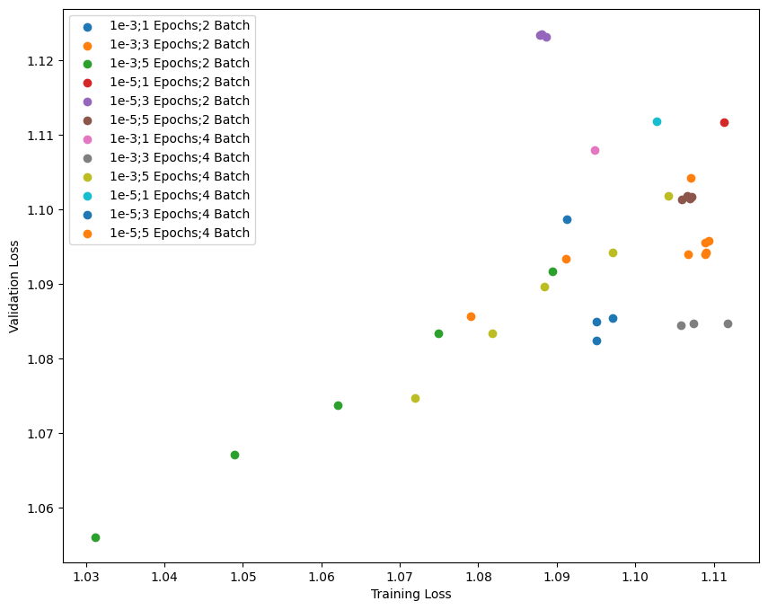

1. *Positive Correlation*: The plot suggests a general upward trend, indicating that as Training Loss increases, Validation Loss also increases.

2. *Hyperparameter Variations*:

    - The legend categorizes different trials based on learning rate, number of epochs, and batch size.

    - Different colors indicate different configurations, allowing for a clear comparison.

3. Trials with a higher learning rate (1e-3) and fewer epochs (1, 3) seem to have slightly lower losses compared to those with a smaller learning rate (1e-5).

<div style="page-break-before: always;"></div>


### Model Fluctuation with change in `Epoch`

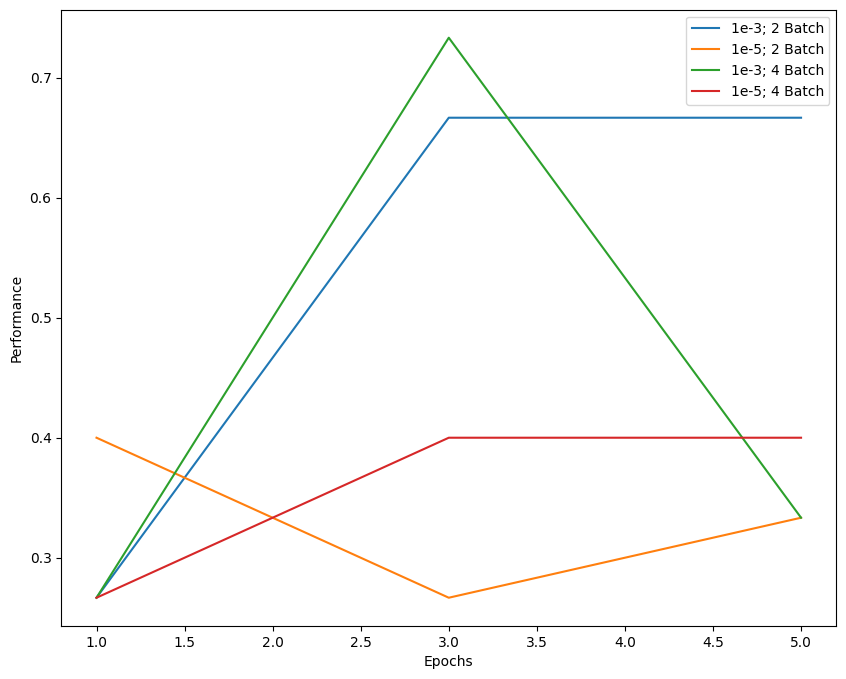

- Most configurations show an increase in performance during the initial epochs.
  
- This is because the model is learning key patterns from the dataset and optimizing its parameters.
  
- Higher learning rates (e.g., 1e-3) lead to faster improvements in fewer epochs.

- Some models stabilize or plateau after a certain number of epochs, indicating that they have reached an optimal state for learning.

<div style="page-break-before: always;"></div>

### Model Fluctuation with change in `Learning Rate`

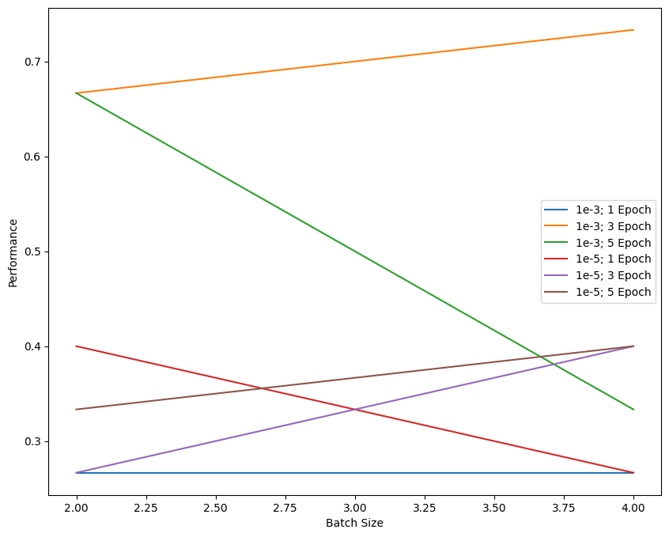

- <b>Inferance</b>: As the learning rate increases, the performance of most configurations steadily `improves`.

<div style="page-break-before: always;"></div>

### Model Fluctuation with change in `Batch Size`
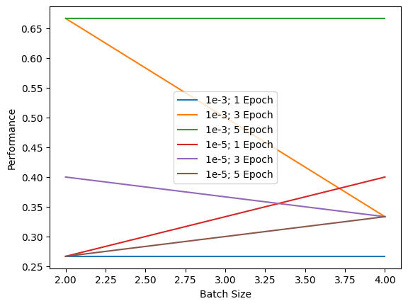

**Observations from the Plot**
- Performance **varies across different learning rates (1e-3, 1e-5)** and **epochs (1, 3, 5)**.
- Larger batch sizes tend to show **decreasing or fluctuating performance**, especially for certain learning rates.
- Smaller batch sizes (e.g., 2) show better performance in some cases, likely due to improved generalization.

<div style="page-break-before: always;"></div>

### Random Search

We will do a random search using AutoGloun (backend: `Ray Tuner` and get the model parameters)

Search Space was defined as the following:

```python
search_space = {
    "lr": tune.choice([1e-3, 1e-5]),
    "num_epochs": tune.choice([1,3,5]),
    "batch_size": tune.choice([2, 4])
}
```

#### Output

| Trial Name             | Status      | Learning Rate | Epochs | Batch Size | Iterations | Total Time (s) | Accuracy | F1 Score  |
|------------------------|------------|--------------|--------|------------|------------|----------------|----------|-----------|
| train_MLP_21169_00000 | TERMINATED | 1e-05        | 5      | 2          | 1          | 1.20604        | 0.266667 | 0.421053  |
| train_MLP_21169_00001 | TERMINATED | 0.001        | 5      | 2          | 1          | 1.22789        | 0.466667 | 0.533333  |
| train_MLP_21169_00002 | TERMINATED | 0.001        | 5      | 2          | 1          | 1.21297        | 0.666667 | 0.786325  |
| train_MLP_21169_00003 | TERMINATED | 1e-05        | 1      | 2          | 1          | 1.09823        | 0.266667 | 0.421053  |
| train_MLP_21169_00004 | TERMINATED | 0.001        | 3      | 2          | 1          | 1.03375        | 0.733333 | 0.828571  |
| train_MLP_21169_00005 | TERMINATED | 0.001        | 1      | 2          | 1          | 0.999687       | 0.266667 | 0.421053  |
| train_MLP_21169_00006 | TERMINATED | 1e-05        | 3      | 2          | 1          | 1.12087        | 0.266667 | 0.421053  |
| train_MLP_21169_00007 | TERMINATED | 0.001        | 3      | 2          | 1          | 1.05694        | 0.4      | 0.56      |
| train_MLP_21169_00008 | TERMINATED | 0.001        | 3      | 2          | 1          | 1.00531        | 0.333333 | 0.433333  |
| train_MLP_21169_00009 | TERMINATED | 0.001        | 5      | 2          | 1          | 1.10407        | 0.266667 | 0.414815  |

#### Total Training Time: **11.066727 seconds**

#### Best Configuration
```json
{
  "lr": 0.001,
  "num_epochs": 3,
  "batch_size": 2
}
```
<div style="page-break-before: always;"></div>

### Hyperband Search

We will do a hyperband search using AutoGloun (backend: `Ray Tuner`; sheduler: `HyperbandScheduler`) and get the model parameters

#### Experiment Results  

| Trial Name             | Status      | Learning Rate | Epochs | Batch Size | Iterations | Total Time (s) | Accuracy | F1 Score  |
|------------------------|------------|--------------|--------|------------|------------|----------------|----------|-----------|
| train_MLP_333f5_00000 | TERMINATED | 0.001        | 5      | 4          | 1          | 1.14064        | 0.266667 | 0.369231  |
| train_MLP_333f5_00001 | TERMINATED | 1e-05        | 3      | 2          | 1          | 1.12037        | 0.266667 | 0.421053  |
| train_MLP_333f5_00002 | TERMINATED | 1e-05        | 3      | 2          | 1          | 1.05419        | 0.333333 | 0.5       |
| train_MLP_333f5_00003 | TERMINATED | 0.001        | 5      | 4          | 1          | 1.11868        | 0.666667 | 0.769231  |
| train_MLP_333f5_00004 | TERMINATED | 1e-05        | 5      | 4          | 1          | 1.06551        | 0.733333 | 0.828571  |
| train_MLP_333f5_00005 | TERMINATED | 1e-05        | 5      | 4          | 1          | 1.00337        | 0.4      | 0.571429  |
| train_MLP_333f5_00006 | TERMINATED | 1e-05        | 3      | 2          | 1          | 1.03871        | 0.466667 | 0.577143  |
| train_MLP_333f5_00007 | TERMINATED | 0.001        | 3      | 4          | 1          | 1.04353        | 0.333333 | 0.5       |
| train_MLP_333f5_00008 | TERMINATED | 1e-05        | 5      | 2          | 1          | 1.31153        | 0.4      | 0.571429  |
| train_MLP_333f5_00009 | TERMINATED | 1e-05        | 5      | 2          | 1          | 1.19259        | 0.333333 | 0.5       |
| train_MLP_333f5_00010 | TERMINATED | 1e-05        | 5      | 4          | 1          | 1.08369        | 0.266667 | 0.421053  |
| train_MLP_333f5_00011 | TERMINATED | 1e-05        | 1      | 4          | 1          | 0.930045       | 0.333333 | 0.5       |
| train_MLP_333f5_00012 | TERMINATED | 0.001        | 5      | 2          | 1          | 1.23356        | 0.666667 | 0.769231  |
| train_MLP_333f5_00013 | TERMINATED | 1e-05        | 5      | 2          | 1          | 1.18108        | 0.666667 | 0.769231  |
| train_MLP_333f5_00014 | TERMINATED | 1e-05        | 1      | 4          | 1          | 0.904613       | 0.333333 | 0.5       |
| train_MLP_333f5_00015 | TERMINATED | 0.001        | 1      | 4          | 1          | 0.992929       | 0.333333 | 0.428571  |
| train_MLP_333f5_00016 | TERMINATED | 1e-05        | 5      | 2          | 1          | 1.17069        | 0.333333 | 0.5       |
| train_MLP_333f5_00017 | TERMINATED | 0.001        | 1      | 2          | 1          | 1.12946        | 0.333333 | 0.5       |
| train_MLP_333f5_00018 | TERMINATED | 0.001        | 5      | 2          | 1          | 1.45521        | 0.666667 | 0.769231  |
| train_MLP_333f5_00019 | TERMINATED | 1e-05        | 5      | 2          | 1          | 1.18111        | 0.733333 | 0.828571  |

#### Total Training Time: **22.361398 seconds**

#### Best Configuration

```json
{
  "lr": 1e-05,
  "num_epochs": 5,
  "batch_size": 4
}
```
<div style="page-break-before: always;"></div>


### Baysiean Search


We will do a hyperband search using AutoGloun (backend: `Ray Tuner`; alogorithm: `BayesOptSearch`) and get the model parameters
| Configuration for experiment     | train_MLP_2025-02-26_13-51-12 |
|----------------------------------|-------------------------------|
| **Search algorithm**             | SearchGenerator               |
| **Scheduler**                    | FIFOScheduler                 |
| **Number of trials**              | 5                             |

#### **Results**

| Trial Name           | Status     | Learning Rate | Num Epochs | Batch Size | Iter | Total Time (s) | Accuracy  | F1 Score  |
|----------------------|------------|--------------|------------|------------|------|---------------|-----------|-----------|
| train_MLP_f7c966ac  | TERMINATED | 5.88e-05     | 4          | 3          | 1    | 1.10065       | 0.266667  | 0.421053  |
| train_MLP_571a3499  | TERMINATED | 0.000846     | 2          | 4          | 1    | 1.0377        | 0.533333  | 0.636257  |
| train_MLP_18973f21  | TERMINATED | 0.000142     | 4          | 3          | 1    | 1.19837       | 0.266667  | 0.421053  |
| train_MLP_494594e3  | TERMINATED | 0.000980     | 5          | 4          | 1    | 1.10084       | 0.266667  | 0.421053  |
| train_MLP_505568a9  | TERMINATED | 0.000790     | 2          | 4          | 1    | 0.997634      | 0.666667  | 0.786325  |


#### Best Config:

```json
{
  "lr": 0.0007897842804285067,
  "num_epochs": 2,
  "batch_size": 4
}
```

#### Run Time: **5.44s**

<div style="page-break-before: always;"></div>

# **Hyperparameter Tuning Results**

## **Comparison of Different Tuning Methods**

| Method      | Learning Rate | Num Epochs | Batch Size | Accuracy  | F1 Score  | Time (s) | Trials |
|------------|--------------|------------|------------|-----------|-----------|----------|--------|
| **Bayesian**   | 0.00079      | 2          | 4          | 0.666667  | 0.786325  | 5.44     | 5      |
| **Hyperband**  | 0.00001      | 5          | 2          | 0.733333  | 0.828571  | 22.36     | 20  (Forced)     |
| **Random**     | 0.00100      | 3          | 2          | 0.733333  | 0.828571  |  11.06    | 10 (Forced)     |
| **Grid**       | 0.00100      | 3          | 2          | 0.733333  | 0.828571  | 61.94     | 12      |


## Manual Tuning vs. Automated Search  

Automated search methods like **Bayesian optimization, Hyperband, and Grid Search** systematically explore hyperparameters, leading to better accuracy and efficiency.  

- **Bayesian optimization** achieves high accuracy in less time, making it efficient.  
- **Hyperband and Random Search** can find optimal configurations but the number of trials required is not known before hand.  
- **Grid Search** is exhaustive but very time-consuming.  


